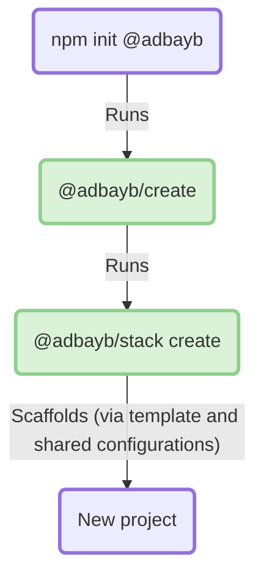

<div align="center">
    <h1>🦦 Stack</h1>
    <strong>My opinionated scaffolding tool to ease project building</strong>
</div>
<br>
<br>

## ✨ Features

`Stack` allows creating an NPM project in a **quick**, **easy** and **opinionated** way with:

- A unified monorepo-driven and git-driven approach for all kinds of projects (single-purpose library, multiple libraries, application(s), ...)
- Support for several application templates (for now, only a default template is available, but others can be added later)
- Standardized file structure including optional folder creation such as `examples`, `packages`, ...
- Enable all project lifecycle steps with commands from the setup, check, fix, build, and test to the versioning and release
- Built-in configuration preset setup (including Node/NPM runtime, Git ignore/hooks, [TypeScript](./config/typescript/), [ESLint](./config/eslint), [Prettier](./config/prettier/), EditorConfig, Renovate, Changesets, and VSCode)
- A welcoming environment for users and contributors with the continuous integration setup, and the creation of `README.md`, `CONTRIBUTING.md`, and GitHub template files (including issue and pull request ones), ...
- An optimized development environment with command caching (no build needed if nothing changes)

<br>

## 🚀 Usage

This section introduces the `stack` essentials by walking through its main commands:

1️⃣ Create the NPM project via the `@adbayb/create` initializer:

```bash
# Npm
npm init @adbayb
# Pnpm
pnpm create @adbayb
```

2️⃣ Play with available commands (already set up in the generated root `package.json`):

```bash
# Setup initial requirements (including Git hooks installation)
stack install
# Clean the project
stack clean
# Check code health (static analysis including linters, types, and commit message)
stack check
# Fix auto-fixable issues
stack fix
# Start the project in production mode
stack start
# Build the project in production mode
stack build
# Build and start the project in development mode
stack watch
# Test the code execution
stack test
# Log, version, and publish package(s)
stack release
```

3️⃣ Enjoy!

<br>

## 🌍 Ecosystem

### Available configurations

- [@adbayb/stack/eslint](https://github.com/adbayb/stack/blob/main/stack/config/eslint/) to align logical and stylistic rules across projects.
- [@adbayb/stack/prettier](https://github.com/adbayb/stack/blob/main/stack/config/prettier/) to align code formatting conventions across projects.
- [@adbayb/stack/typescript](https://github.com/adbayb/stack/blob/main/stack/config/typescript/) to align type checking and processing across projects.

### Used technologies

- **Static code analysis**: ESLint, Prettier
- **Node package manager**: PNPM
- **Task orchestration**: Turborepo
- **Release**: Changesets
- **Testing**: Vitest

### Used conventions

- [Commits](https://www.conventionalcommits.org/)
- [Scripts](https://conventionalscripts.org/)
- [File Structure](https://nx.dev/concepts/decisions/folder-structure)
  - Monorepo-first structure to:
    - Keep a consistent file structure pattern across templates (ease template familiarity and onboarding).
    - Ease examples setup.
    - Not clutter the published package with development-related context, metadata, and artifacts.

<br>

## 🏗️ Architecture

### Project creation workflow



<br>

## ✍️ Contribution

We're open to new contributions, you can find more details [here](https://github.com/adbayb/stack/blob/main/CONTRIBUTING.md).

<br>

## 📖 License

[MIT](https://github.com/adbayb/stack/blob/main/LICENSE "License MIT")

<br>
