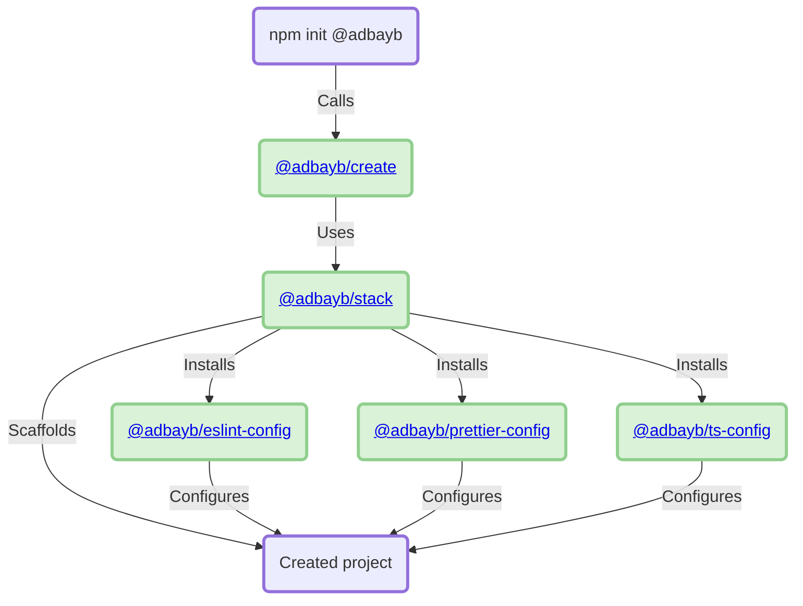

<div align="center">
    <h1>🦦 Stack</h1>
    <strong>My opinionated environment to ease project building</strong>
</div>
<br>
<br>

## ✨ Features

`Stack` allows creating an NPM project in a **quick**, **easy** and **opinionated** with:

-   A unified monorepo-driven and git-driven approach for all kinds of projects (single-purpose library, multiple libraries, application(s), ...)
-   Support for several templates application (for now, only a default template is available but others can be added later)
-   Standardized file structure including optional folder creation such as `examples`, `packages`, ...
-   Enable all project lifecycle steps with commands from the setup, check, fix, build, and test to the versioning and release
-   Built-in configuration preset setup (including Node/NPM runtime, Git ignore/hooks, TypeScript, ESLint, Prettier, EditorConfig, Renovate, Changesets, and VSCode)
-   A welcoming environment for users and contributors with the creation of `README.md`, `CONTRIBUTING.md`, and GitHub template files (including issue and pull request), ...
-   An optimized development environment with command caching (no build needed if nothing changes)

<br>

## 🚀 Usage

This section introduces the `stack` essentials by walking through its main commands:

1️⃣ Create the NPM project thanks to the `@adbayb/create` initializer:

```bash
# npm
npm init @adbayb
# pnpm
pnpm create @adbayb
```

2️⃣ Play with available commands (already set up in the generated root `package.json`):

```bash
# Setup (including Git hooks installation)
stack install
# Clean
stack clean
# Check (static code analysis including linters and type checking)
stack check
# Fix
stack fix
```

3️⃣ Enjoy!

<br>

## 🏗️ Architecture



<br>

## ✍️ Contribution

We're open to new contributions, you can find more details [here](https://github.com/adbayb/stack/blob/main/CONTRIBUTING.md).

<br>

## 📖 License

[MIT](https://github.com/adbayb/stack/blob/main/LICENSE "License MIT")

<br>

## ✅ Todo

-   [ ] **CircleCI setup (+ update the features part)**
-   [ ] **Create folder project (ask GitHub URL) and run git init**
-   [ ] **Deprecate and remove `@adbayb/scripts` package**
-   [ ] **Clean scripts and root package.json after publishing the v1**
-   [ ] Check if it's ok to have `commitlint`, `eslint`, ... as dependencies in `@adbayb/scripts` by removing monorepo root dev dependencies
-   [ ] Update `@adbayb/stack` to make `tsc` check feasible on git hooks (via eslint-plugin-tsc?)
-   [ ] Update `@adbayb/stack` to lint packages (caret range for dependencies and strict ones for dev dependencies)

<br>
